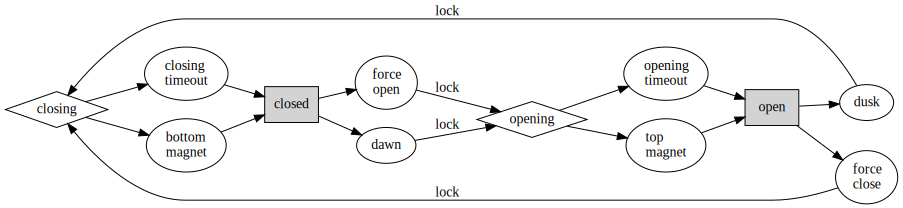
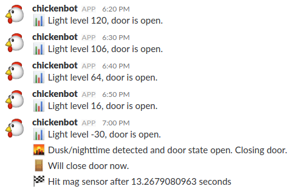

<!-- .element: data-background-image="./img/chicken-at-front-door.jpg" -->
# Automatic Chicken Door HOWTO

## No, it will not hurt the chicken

By [Adam Monsen](http://adammonsen.com), VP Engineering at [C-SATS, Inc.](https://csats.com)

Use space bar or PgDn to advance through slides

### Copyright and license

©2017 - Adam Monsen

<!-- cut & pasted license HTML from creativecommons.org. Easy, and includes
"rel" attributes and metadata. -->

Automatic Chicken Door HOWTO by <a xmlns:cc="http://creativecommons.org/ns#" href="http://adammonsen.com" property="cc:attributionName" rel="cc:attributionURL">Adam Monsen</a> is licensed under a <a rel="license" href="http://creativecommons.org/licenses/by-sa/4.0/">Creative Commons Attribution-ShareAlike 4.0 International License</a>. For permissions beyond the scope of this license, contact <a xmlns:cc="http://creativecommons.org/ns#" href="mailto:haircut@gmail.com" rel="cc:morePermissions">Adam</a>.

This is the story of four chickens

<!-- .element: data-background-image="./img/four-chx.jpg" data-background-size="contain" -->

Who meet a hungry little furball

<!-- .element: data-background-image="./img/800px-Waschbär4.jpg" data-background-size="contain" -->

SpeakerNote: Photo credit Tobias Mercer. Licensed GFDL, CC-by-2.5. [Source](https://commons.wikimedia.org/wiki/File:Waschb%C3%A4r4.jpg)

And quickly become a flock of one.

This is the story of...

## _The Chicken Who Lived_

<!-- .element: data-background-image="./img/suspicious.jpg" data-background-size="contain" -->

## Meet Louise

Our stealthy Ameraucana <!-- .element: style="text-shadow: 2px 2px 4px rgba(190,190,190,1.0);" -->

SpeakerNote: <https://en.wikipedia.org/wiki/Ameraucana>

Louise wants to live and wants a new flock.

First she needs a safer home. 🏠

One with an automatic door!

We need:

<!-- .element: style="font-size: smaller;" -->

* hardware interleave gravity lock mechanism
* instant-read photoresistor poll door actuation trigger
* photoresistor signal analog to digital conversion
* worm gear 12V DC motor controlled via L9110 motor driver chip
* dual hall-effect magnetic door position sensors
* fallback door status mitigating magnetic sensor failure
* night-vision wide-angle camera with motion-triggered video capture
* C + bash + python polyglot control code with standardized output convention
* offline operation with 2.4Ghz wifi for monitoring and maintenance

Or at least a door that automatically opens and closes with the sun. ☀

<!-- .element: data-background-image="./img/463px-We_Can_Do_It.jpg" data-background-size="contain" -->

SpeakerNote: Public domain. [Source](https://commons.wikimedia.org/wiki/File:We_Can_Do_It!.jpg)

<!-- .element: data-background-image="./img/whole-coop.jpg" data-background-size="contain" -->

<!-- .element: data-background-image="./img/door-open.jpg" data-background-size="contain" -->

<!-- .element: data-background-image="./img/door-closed.jpg" data-background-size="contain" -->

<!-- .element: data-background-image="./img/installed-rpi.jpg" data-background-size="contain" -->

<!-- .element: data-background-video="./vid/unlock.webm" data-background-video-loop="true" -->

<!-- .element: data-background-video="./vid/door-open.webm" data-background-video-loop="true" -->

<!-- .element: data-background-video="./vid/settle-in.webm" data-background-size="contain" -->

Louise likes the new coop but when it comes to the door she is...

<!-- .element: data-background-image="./img/suspicious.jpg" -->

# Suspicious!

She'll get over it.

Let's talk about chickens.

# Chicken primer

1. Never get wet
1. Never expose to sunlight
1. Never feed after midnight

SpeakerNote: Sorry, wrong primer (see Gremlins - 1984 movie)

# Real chicken primer

<!-- .element: data-background-image="./img/how-chicken-works.svg" data-background-size="contain" data-background-color="lightgrey" -->

SpeakerNote: They also eat bugs and rocks.

1. Food → Chicken → Egg
1. Chicken not smart
1. Must be locked in at night

# Must be locked in at night

<!-- .element: data-background-image="./img/800px-Waschbär4.jpg" data-background-size="contain" -->

SpeakerNote: Photo credit Tobias Mercer. Licensed GFDL, CC-by-2.5. [Source](https://commons.wikimedia.org/wiki/File:Waschb%C3%A4r4.jpg)

Chickens get in the coop before dusk.

They are pros at this.

All you need to do is lock up the coop at night

_Every night_

And open it in the morning

SpeakerNote: so they can free range and stuff

_Every morning_

_even in the summer when that sun comes up really early and the chickens really really wanna get out at the buttcrack of dawn_

Yeah no. Let's automate it!

# TL;DR 🐔

1. Plan project
1. Buy parts
1. Practice mini-projects
1. Prototype
1. Install
1. Celebrate

# Hardware

## Parts summary

1. Raspberry Pi, motor, sensors
1. Scrap wood, string, magnets

## Parts detail

| Item           | Source      | Cost |
| -------------- | ----------- | ---- |
| Raspberry Pi   | Amazon      | $50  |
| Soldiering kit | Radio shack | $35  |
| Starter kit    | Amazon      | $30  |
| Camera         | Amazon      | $24  |
| Wires          | Amazon      | $15  |
| 12V DC motor   | Amazon      | $14  |

(continued)

| Item           | Source      | Cost |
| -------------- | ----------- | ---- |
| Fuses & holder | Amazon      | $13  |
| 32GB SD card   | Amazon      | $13  |
| Mag sensors    | Amazon      | $7   |
| Test leads     | Amazon      | $6   |
| Power supply   | SparkFun    | $6   |

### Total: $213

SpeakerNote: Minus tax and shipping/handling. See last slide for links.

<!-- .element: data-background-image="./img/rpi-3-diagram.jpg" data-background-size="contain" -->

SpeakerNote: Raspberry Pi w/case by Vilros: $50

<!-- .element: data-background-image="./img/pi-in-case.jpg" data-background-size="contain" -->

SpeakerNote: Raspberry Pi w/case by Vilros: $50

<!-- .element: data-background-image="./img/starter-kit.jpg" data-background-size="contain" -->

SpeakerNote: Adeept starter kit: $30

<!-- .element: data-background-image="./img/fisheye-camera.jpg" data-background-size="contain" -->

SpeakerNote: Fisheye night-vision camera: $24

<!-- .element: data-background-image="./img/wires.jpg" data-background-size="contain" -->

SpeakerNote: Wires: $15

<!-- .element: data-background-image="./img/motor.jpg" data-background-size="contain" -->

SpeakerNote: Motor: $14

<!-- .element: data-background-image="./img/fuse.jpg" data-background-size="contain" -->

SpeakerNote: Fuse holder & fuses: $13

<!-- .element: data-background-image="./img/sd-card.jpg" data-background-size="contain" -->

SpeakerNote: 32GB SD card: $13

<!-- .element: data-background-image="./img/mag-sensor.jpg" data-background-size="contain" -->

SpeakerNote: Bag of mag sensors: $7

<!-- .element: data-background-image="./img/test-leads.jpg" data-background-size="contain" -->

SpeakerNote: Test leads: $6

<!-- .element: data-background-image="./img/power-supply.jpg" data-background-size="contain" -->

SpeakerNote: Regulated power supply: $6

<!-- .element: data-background-image="./img/scrap-wood.jpg" data-background-size="contain" -->

# Software

⏰ Cron job runs every 10 minutes.

1. Poll 📊 light level and 🚪 door state.
1. 🌇 Door open & sun down? → `close door`.
1. 🐣 Door closed & sun up? → `open door`.

## Door control flow

* shaded rectangle: resting state
* diamond: active state
* ellipse: trigger to/from active state
* "lock" enforces atomic opening/closing

# Log

## Starter kit

🚵 Easy, fun

📖 Beginner-friendly manual with 13 projects

✔ Background info, diagrams, photos, code

📧 Email support

Helps you bridge the gap where hardware meets software.

<!-- .element: data-background-image="./img/led-blink-wiring-diagram.png" data-background-size="contain" -->

## More ideas

* [Use Raspian OS](https://www.raspberrypi.org/downloads/raspbian/) 🐧
    * codename: "stretch" (with desktop)
* Try the camera: do a time-lapse video 🎥
* Try a project from a Starter Kit (e.g. Adeept)

SpeakerNote: Add mouse + keyboard + monitor for a perfect kid desktop!

* Ask for help! 💭
* Try combining sensors / lights / camera 📷
* Use lots of emoji
    * 🐔 📊 🚪 🚦 😓 ⏰ 🏁 🐣 🌇 📡 📷 🚧
    * seriously
    * one per unique log event 🌲

## Lessons learned

* If the Raspberry Pi won't boot, unplug all peripherals and try again. If USB ports are full, peripherals may draw too much power. 🗲
* Get help, ask around. Call friends. Pair up. Find a local maker space. 🛠
* I'm incredibly lucky to have a brilliant, patient partner who is great at woodwork and code. 👩

(continued)

* Use a 32GB flash card. I bricked a 64GB card.
* Easy: camera. Plug & play! 🔌
* Easy: loose tolerance for software (slow door, 10min between light checks).
* Hard: door actuator: spindle, dealing with drag/resistance. Tight tolerance. 🚪
    * Temperature and humidity affect (wooden) door operation. 📊
* Hard: 12V DC motor. L9110 controller is tricky to wire. Software is complex. Wasted time on [PWM](https://learn.sparkfun.com/tutorials/pulse-width-modulation).

(continued)

SpeakerNote: PWM - Pulse Width Modulation. Use fluttering gas pedal analogy.

* Easy: magnetic (hall effect) sensor.
* Hard: Adeept Python photoresistor code didn't work, but C code did.
* Easy: posting messages to IRC or Slack.
* Early mistake: motion alerts for all chicken movement. 🐔
* [Adeept source is on GitHub](https://github.com/adeept/)
* Nocturnal predators may also hunt during the day, and there are other daytime predators too. 🐕

(continued)

* Saw the effect of the near-total eclipse. 🌑
* Always MVP and iterate.

## Links to buy parts

* [Raspberry Pi 3 model B with clear case by Vilros](https://www.amazon.com/gp/product/B01D92SSX6/)
* Soldering iron, "helping hands", rosin-core soldier, desoldiering braid
* [Adeept starter kit](https://www.amazon.com/gp/product/B01GHVNP0M/)
* [Fisheye night-vision camera](https://www.amazon.com/gp/product/B06XNV5R6T/)
* [Solid hook-up wire kit - 6 colors dispenser box](https://www.amazon.com/gp/product/B008L3QJAS/)
* [25rpm 12V DC worm gear motor](https://www.amazon.com/gp/product/B01N1JQFYX/)

(continued)

* [0.3A glass fuse & holder](https://www.amazon.com/gp/product/B01FWR2R38/)
* [bag o' hall effect (magnetic) sensors](https://www.amazon.com/gp/product/B00ATNJH20/)
* [bag o' test leads (wires with alligator clips at ends)](https://www.amazon.com/gp/product/B0002KRABU/)
* [SanDisk Ultra 32GB microSDHC UHS-I Card](https://www.amazon.com/gp/product/B010Q57T02/)
* [12VDC 600mA regulated power supply](https://www.sparkfun.com/products/9442)

# Thank you!

* Source <https://github.com/meonkeys/rpi-chx-code>
* Slides <https://github.com/meonkeys/seagl2017-rpi-talk>
* Blog <http://adammonsen.com>
* Email <haircut@gmail.com>

SpeakerNote: I want to hear what works for you or what I could do better. Please let me know!
